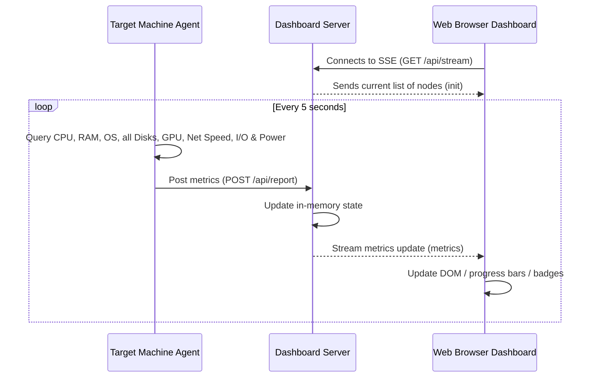

# 🖥️ HomeLab Dashboard

A premium, lightweight, real-time home lab monitoring dashboard designed specifically for low-power servers. It collects and displays status, system metrics, GPU usage, multi-disk storage, live bandwidth speeds, active VPNs, and Docker container states across multiple machines using a **Push-based** model and **Server-Sent Events (SSE)**.

---

## ✨ Features

- **🌐 Real-Time Updates**: Leverages Server-Sent Events (SSE) for instant, low-overhead updates to your browser without polling.
- **🎨 Premium UI**: A modern, responsive dark-mode dashboard styled with glassmorphism, glowing accents, and dynamic animations.
- **🔒 Admin Authentication**: Password-protected access using industry-standard PBKDF2-SHA256 password hashing. Features a secure first-run setup overlay for creating the administrator account, blocking any unauthenticated requests.
- **🔑 Agent API Security**: Secures metrics reporting by validating a unique `X-Agent-Key` header on ingestion, preventing unauthorized endpoints from submitting fake telemetry.
- **📊 30-Day SQLite History**: Power history is persisted locally in `backend/history.db` on your SSD. Features time-range buttons on the UI (`6H`, `24H`, `7D`, `30D`) and SQL-level downsampling for ultra-fast load times.
- **🔄 Pending OS Updates**: Automatically checks for pending OS/software updates (asynchronously in a background thread once every 4 hours to prevent network blocking). Displays a glowing, pulsing warning badge next to the online status of the client card.
- **🖥️ Hardware Telemetry**:
  - **CPU & RAM**: Live utilization tracking, marketing name retrieval, and core count display.
  - **Power Draw (Wattage)**: Real-time CPU and GPU wattage tracking, plus estimated monthly electricity costs based on run-time.
  - **Multi-Disk Storage**: Automatically scans all active storage partitions with individual capacity bars and live read/write I/O speed throughput.
  - **Live Bandwidth**: Displays real-time download and upload transfer rates.
  - **NVIDIA GPU Monitor**: Auto-detects NVIDIA cards and displays model name, utilization, VRAM usage, power draw, and GPU temperature.
- **📡 Latency Ping Sweep**: The dashboard server runs a background sweep to ping active node IPs and display round-trip latency (color-coded by speed).
- **🔒 VPN Status**: Checks active network interfaces to display the state of your **Tailscale** and **OpenVPN** connections.
- **🐳 Docker Containers**: Lists all local containers on each host with their current state (running/stopped).
- **📌 Favorites Pinning**: Pin your most important servers to the top of the grid. Pin preferences are stored in the browser's `localStorage` for zero-server-overhead persistence.
- **🔔 Alarm Chimes & Alert Hysteresis**: 
  - Synthesizes sci-fi alarm sounds (via browser Web Audio API) and slides in critical warning alerts when CPU/GPU load or temperature exceed limits.
  - Features dual-threshold **hysteresis** (e.g. triggers at 85%, recovers at 75%) to prevent flapping alert notifications when utilization fluctuates.
  - Displays green success alerts when critical systems recover.

---

## 📐 Architecture

The dashboard uses a **Push-based model** that operates smoothly behind NATs, firewalls, and VPN tunnels:

1. **`agent/` (Python client)**: Runs on monitored hosts and POSTs local metrics, drive speeds, and power draw to the dashboard server every 5 seconds.
2. **`backend/` (FastAPI server)**: Runs on the central dashboard server, sweeps active node pings, stores client states in-memory, and broadcasts updates to open dashboards.
3. **`frontend/` (Vanilla Web UI)**: Static HTML, CSS, and JS served by the backend. Features custom canvas line charts. No compilation or node build pipelines are required.



---

## 📂 Project Structure

```text
├── agent/
│   ├── agent.py            # Portable metric collection script
│   ├── homelab-agent.service # Systemd service template for Linux client
│   └── requirements.txt    # Agent dependencies (psutil)
├── backend/
│   ├── main.py             # FastAPI server, ping sweeper & static file host
│   ├── homelab-dashboard.service # Systemd service template for APU/Server
│   └── requirements.txt    # Server dependencies (fastapi, uvicorn)
├── frontend/
│   ├── index.html          # Dashboard page structure
│   ├── index.css           # Premium glassmorphic styles
│   └── app.js              # Real-time SSE handler & DOM controller
└── .gitignore              # Files ignored in repository
```

---

## 🚀 Setup & Installation

### 1. Central Server Setup

On your main dashboard server (running Linux/Ubuntu/Debian or Windows):

1. **Clone the repository**:
   ```bash
   git clone https://github.com/yourusername/homelab-dashboard.git
   cd homelab-dashboard/backend
   ```
2. **Set up a virtual environment**:
   ```bash
   python3 -m venv .venv
   source .venv/bin/activate
   pip install -r requirements.txt
   ```
3. **Run the server**:
   ```bash
   uvicorn main:app --host 0.0.0.0 --port 8000 --timeout-graceful-shutdown 1
   ```
4. **Access the Web UI & Register**: Open your browser and navigate to `http://<YOUR-SERVER-IP>:8000`.
   - On the very first load, you will be prompted to **Create Admin Account**. Create your administrator username and password to secure the dashboard.
   - Once logged in, copy the **Agent Key** displayed in the top header summary bar (you will need this key to configure your client machine agents).

#### Running as a systemd Service (Linux)

To ensure the dashboard server starts automatically at boot, you can use the provided systemd service file:

1. **Edit the service file**: 
   Open `backend/homelab-dashboard.service` and update the `User`, `WorkingDirectory`, and `ExecStart` paths to match your installation:
   ```ini
   WorkingDirectory=/path/to/homelab-dashboard/backend
   ExecStart=/path/to/homelab-dashboard/backend/.venv/bin/uvicorn main:app --host 0.0.0.0 --port 8000 --timeout-graceful-shutdown 1
   ```
2. **Copy to systemd directory**:
   ```bash
   sudo cp homelab-dashboard.service /etc/systemd/system/
   ```
3. **Enable and start the service**:
   ```bash
   sudo systemctl daemon-reload
   sudo systemctl enable homelab-dashboard.service
   sudo systemctl start homelab-dashboard.service
   ```
4. **Check status**:
   ```bash
   sudo systemctl status homelab-dashboard.service
   ```

---

### 2. Client Agent Setup

Deploy this lightweight agent on every machine you want to monitor:

1. **Copy the `agent/` folder** to the host machine.
2. **Configure Server URL & Agent Key**:
   Open `agent.py` in an editor and update the `SERVER_URL` and `AGENT_KEY` variables to match your central server's credentials:
   ```python
   SERVER_URL = "http://<YOUR-SERVER-IP>:8000/api/report"
   AGENT_KEY = "your_copied_agent_key_here"
   ```
3. **Install dependencies and run**:
   - **Linux / NAS**:
     ```bash
     python3 -m venv .venv
     source .venv/bin/activate
     pip install -r requirements.txt
     python agent.py
     ```
   - **Windows**:
     ```powershell
     python -m venv .venv
     .\.venv\Scripts\pip.exe install -r requirements.txt
     .\.venv\Scripts\python.exe agent.py
     ```

#### Running as a systemd Service (Linux)

To run the agent in the background as a systemd service on your Linux client machines:

1. **Edit the service file**:
   Open `agent/homelab-agent.service` and update the `User`, `WorkingDirectory`, and `ExecStart` paths to match your agent directory:
   ```ini
   WorkingDirectory=/path/to/homelab-dashboard/agent
   ExecStart=/path/to/homelab-dashboard/agent/.venv/bin/python agent.py
   ```
2. **Copy to systemd directory**:
   ```bash
   sudo cp homelab-agent.service /etc/systemd/system/
   ```
3. **Enable and start the service**:
   ```bash
   sudo systemctl daemon-reload
   sudo systemctl enable homelab-agent.service
   sudo systemctl start homelab-agent.service
   ```
4. **Check status**:
   ```bash
   sudo systemctl status homelab-agent.service
   ```

#### Running silently in the background on Startup (Windows)

To ensure the agent runs silently in the background on your Windows gaming machine (without opening an annoying terminal window or stealing window focus during gaming/daily tasks):

> [!IMPORTANT]
> **Do not configure the task to repeat in Task Scheduler!** The agent has a built-in loop that queries metrics every 5 seconds. The task should only run **once** when you log on and remain running in the background.

1. Open **Task Scheduler** from the Start Menu.
2. Click **Create Basic Task...** and name it `HomeLab Agent`.
3. Set Trigger to **When I log on**.
4. Set Action to **Start a Program**.
5. Set **Program/script** to point to `pythonw.exe` inside your virtual environment (using `pythonw` runs the script silently with no console):
   ```text
   C:\path\to\homelab-dashboard\agent\.venv\Scripts\pythonw.exe
   ```
6. Set **Add arguments (optional)** to:
   ```text
   agent.py
   ```
7. Set **Start in (optional)** to your absolute agent directory:
   ```text
   C:\path\to\homelab-dashboard\agent
   ```
8. Click **Next** and **Finish**.

> [!NOTE]
> The agent code is built to run child commands (like CPU power queries via PowerShell or GPU queries via `nvidia-smi`) with the `CREATE_NO_WINDOW` flag (`0x08000000`). This ensures these queries run completely silently in the background and will never steal window focus from games or other applications.

---

## 🛠️ Customization

- **Icons**: The dashboard auto-maps hostnames to icons in `frontend/app.js`. If you have a specific machine type, update the `getDeviceIcon` function:
  ```javascript
  function getDeviceIcon(hostname) {
      const name = hostname.toLowerCase();
      if (name.includes('gaming')) return 'fa-solid fa-desktop';
      if (name.includes('nas')) return 'fa-solid fa-database';
      return 'fa-solid fa-server';
  }
  ```
- **Styling**: All colors, blur values, and animations are defined using CSS variables in the `:root` block of `frontend/index.css`. You can customize them to match your setup's color theme.

---

## 📝 License

This project is open-sourced under the MIT License. Feel free to fork, modify, and distribute it for your own homelab setups!
