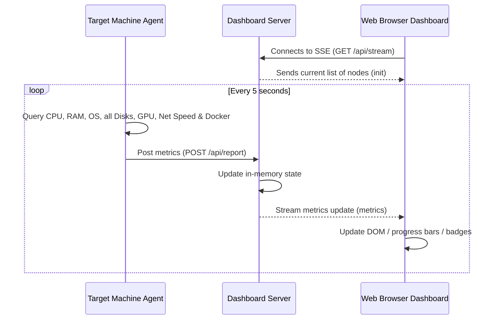

# 🖥️ HomeLab Dashboard

A premium, lightweight, real-time home lab monitoring dashboard designed specifically for low-power servers. It collects and displays status, system metrics, GPU usage, multi-disk storage, live bandwidth speeds, active VPNs, and Docker container states across multiple machines using a **Push-based** model and **Server-Sent Events (SSE)**.

---

## ✨ Features

- **🌐 Real-Time Updates**: Leverages Server-Sent Events (SSE) for instant, low-overhead updates to your browser without polling.
- **🎨 Premium UI**: A modern, responsive dark-mode dashboard styled with glassmorphism, glowing accents, and dynamic animations.
- **🖥️ Hardware Telemetry**:
  - **CPU & RAM**: Live utilization tracking, marketing name retrieval, and core count display.
  - **Multi-Disk Storage**: Automatically scans and lists all active storage partitions with individual capacity bars.
  - **Live Bandwidth**: Displays real-time download and upload transfer rates.
  - **NVIDIA GPU Monitor**: Auto-detects NVIDIA cards and displays model name, utilization, VRAM usage, and GPU temperature.
- **🔒 VPN Status**: Checks active network interfaces to display the state of your **Tailscale** and **OpenVPN** connections.
- **🐳 Docker Containers**: Lists all local containers on each host with their current state (running/stopped).
- **🔌 Auto-Registration & Offline Detection**: New agent-bearing machines register automatically, and the UI flags nodes as offline if they stop reporting for over 15 seconds.

---

## 📐 Architecture

The dashboard uses a **Push-based model** that operates smoothly behind NATs, firewalls, and VPN tunnels:

1. **`agent/` (Python client)**: Runs on monitored hosts (PCs, servers, NAS, virtual machines) and POSTs local metrics to the dashboard server every 5 seconds.
2. **`backend/` (FastAPI server)**: Runs on the central dashboard server, stores the state of registered clients in-memory, and broadcasts updates to open dashboards.
3. **`frontend/` (Vanilla Web UI)**: Static HTML, CSS, and JS served by the backend. No compilation or build pipelines (Vite/Webpack) are required at runtime.



---

## 📂 Project Structure

```text
├── agent/
│   ├── agent.py            # Portable metric collection script
│   └── requirements.txt    # Agent dependencies (psutil)
├── backend/
│   ├── main.py             # FastAPI server & static file host
│   └── requirements.txt    # Server dependencies (fastapi, uvicorn)
├── frontend/
│   ├── index.html          # Dashboard page structure
│   ├── index.css           # Premium glassmorphic styles
│   └── app.js              # Real-time SSE handler & DOM controller
└── .gitignore              # Files ignored in repository
```

---

## 🚀 Setup & Installation

### 1. Central Server Setup

On your main dashboard server (running Linux/Ubuntu/Debian or Windows):

1. **Clone the repository**:
   ```bash
   git clone https://github.com/yourusername/homelab-dashboard.git
   cd homelab-dashboard/backend
   ```
2. **Set up a virtual environment**:
   ```bash
   python3 -m venv .venv
   source .venv/bin/activate
   pip install -r requirements.txt
   ```
3. **Run the server**:
   ```bash
   uvicorn main:app --host 0.0.0.0 --port 8000
   ```
4. **Access the Web UI**: Open your browser and navigate to `http://<YOUR-SERVER-IP>:8000`.

*Tip: You can set up Uvicorn as a systemd service (Linux) or run it as a background service to ensure the dashboard starts automatically at boot.*

---

### 2. Client Agent Setup

Deploy this lightweight agent on every machine you want to monitor:

1. **Copy the `agent/` folder** to the host machine.
2. **Configure the Server URL**:
   Open `agent.py` in an editor and change the `SERVER_URL` variable to point to your central server's IP address:
   ```python
   SERVER_URL = "http://<YOUR-SERVER-IP>:8000/api/report"
   ```
3. **Install dependencies and run**:
   - **Linux / NAS**:
     ```bash
     python3 -m venv .venv
     source .venv/bin/activate
     pip install -r requirements.txt
     python agent.py
     ```
   - **Windows**:
     ```powershell
     python -m venv .venv
     .\.venv\Scripts\pip.exe install -r requirements.txt
     .\.venv\Scripts\python.exe agent.py
     ```

Once started, the agent will instantly register and begin streaming metrics to your dashboard!

---

## 🛠️ Customization

- **Icons**: The dashboard auto-maps hostnames to icons in `frontend/app.js`. If you have a specific machine type, update the `getDeviceIcon` function:
  ```javascript
  function getDeviceIcon(hostname) {
      const name = hostname.toLowerCase();
      if (name.includes('gaming')) return 'fa-solid fa-desktop';
      if (name.includes('nas')) return 'fa-solid fa-database';
      return 'fa-solid fa-server';
  }
  ```
- **Styling**: All colors, blur values, and animations are defined using CSS variables in the `:root` block of `frontend/index.css`. You can customize them to match your setup's color theme.

---

## 📝 License

This project is open-sourced under the MIT License. Feel free to fork, modify, and distribute it for your own homelab setups!
