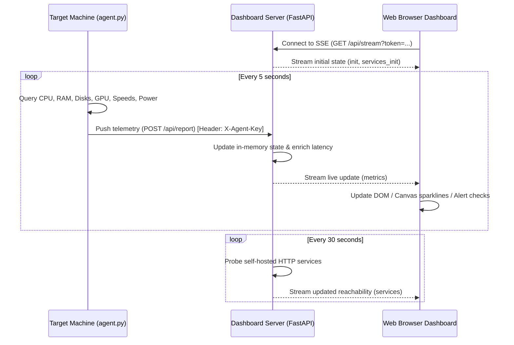

# 🖥️ HomeLab Dashboard & Monitoring Fleet

A lightweight, real-time homelab monitoring suite designed specifically for resource-constrained microservers, low-power appliances (such as PC Engines APU2, Intel NUCs, Raspberry Pis), NAS systems, and workstations.

It combines an outbound **push-based telemetry model** with real-time **Server-Sent Events (SSE)**, eliminating complex network scraping and firewall configuration while delivering sub-second updates to a zero-build vanilla web UI.

---

## 📚 Documentation Index

For exhaustive technical guides, please refer to the dedicated documentation suite:

| Document | Description |
| :--- | :--- |
| **[Architecture & Design](docs/ARCHITECTURE.md)** | Telemetry data flow, SQLite persistence, downsampling strategy, and background worker concurrency. |
| **[API Reference](docs/API_REFERENCE.md)** | Full specification of all REST endpoints, authentication headers, JSON payloads, and SSE stream protocols. |
| **[Agent Guide & Telemetry](docs/AGENT_GUIDE.md)** | Multi-platform metric collection, Intel/AMD RAPL, WMI, NVIDIA GPU queries, update detection, and TDP estimation models. |
| **[Services Monitoring](docs/SERVICES_MONITORING.md)** | Probing self-hosted web applications, `services.json` schema, categories, and backend network isolation. |
| **[Frontend System & UI](docs/FRONTEND_SYSTEM.md)** | Design tokens, HTML5 Canvas charts & sparklines, Web Audio API sci-fi alarm chime, and hysteresis alerting. |
| **[Production Deployment](docs/DEPLOYMENT_GUIDE.md)** | Production setup on Linux/Windows, systemd services, Nginx reverse proxy with SSE buffering, and security hardening. |
| **[Troubleshooting & Diagnostics](docs/TROUBLESHOOTING.md)** | Step-by-step diagnostic guide for connection issues, authentication resets, sensor permissions, and audio policies. |

---

## ✨ Key Features

- **🌐 Push-Based Telemetry**: Client nodes push telemetry outbound every 5 seconds. Seamlessly operates through NATs, firewalls, and VPN tunnels without requiring open inbound ports on monitored hosts.
- **⚡ Real-Time SSE Streaming**: Live updates stream directly into your browser over an efficient persistent HTTP Server-Sent Events connection.
- **🎨 Zero-Build Modern UI**: Built with vanilla ES6 JavaScript modules, HTML5 Canvas, and a token-driven CSS architecture. Zero `npm build`, Webpack, or framework bloat required.
- **🔒 Multi-Layer Security**:
  - Administrative access secured with **PBKDF2-HMAC-SHA256** password hashing and 14-day bearer session tokens.
  - First-run setup overlay automatically initializes the master admin account and locks subsequent registration.
  - Ingestion secured via a unique, cryptographically generated `X-Agent-Key` header.
- **📊 30-Day SQLite History & Downsampling**: Lab-wide power consumption is logged every minute with automatic 30-day retention pruning. Features fast mathematical integer-bucketing downsampling (`6H`, `24H`, `7D`, `30D`).
- **🖥️ Deep Hardware Instrumentation**:
  - **CPU & RAM**: Marketing model retrieval, core count breakdown, and live utilization bars with real-time Canvas sparklines.
  - **Power Draw (Watts)**: Real-time CPU and GPU wattage tracking (via Linux RAPL / hwmon, Windows Performance Counters, or TDP load interpolation) with estimated monthly running electricity costs.
  - **Storage & I/O**: Multi-disk partition scanning with individual utilization meters and live read/write throughput speeds ($\text{MB/s}$).
  - **Network & Bandwidth**: Live download/upload transfer rates.
  - **NVIDIA GPU Monitoring**: Auto-detects NVIDIA cards with utilization, VRAM usage, temperature, and wattage.
  - **VPN & Docker**: Live state detection for Tailscale, OpenVPN, and running Docker containers.
- **🔄 Asynchronous OS Update Detection**: Runs in a non-blocking background thread once every 4 hours to check for pending packages on Linux (Ubuntu/Debian) and Windows without stalling telemetry.
- **🔔 Alarm Chimes & Hysteresis**:
  - Synthesizes sci-fi alarm tones using the browser's native **Web Audio API** (zero external audio assets).
  - Dual-threshold **hysteresis** (e.g. triggers at 85%, clears at 75%) to eliminate notification flapping.
- **📌 Customization & Device Pinning**: Pin your most critical servers to the top of the grid with zero-overhead `localStorage` persistence.

---

## 📐 System Architecture


```mermaid
sequenceDiagram
    participant Agent as Target Machine (agent.py)
    participant Backend as Dashboard Server (FastAPI)
    participant Browser as Web Browser Dashboard

    Browser->>Backend: Connect to SSE (GET /api/stream?token=...)
    Backend-->>Browser: Stream initial state (init, services_init)

    loop Every 5 seconds
        Agent->>Agent: Query CPU, RAM, Disks, GPU, Speeds, Power
        Agent->>Backend: Push telemetry (POST /api/report) [Header: X-Agent-Key]
        Backend->>Backend: Update in-memory state & enrich latency
        Backend-->>Browser: Stream live update (metrics)
        Browser->>Browser: Update DOM / Canvas sparklines / Alert checks
    end

    loop Every 30 seconds
        Backend->>Backend: Probe self-hosted HTTP services
        Backend-->>Browser: Stream updated reachability (services)
    end
```

---

## 📂 Project Structure

```text
├── agent/
│   ├── agent.py                  # Portable metric collection script
│   ├── homelab-agent.service     # Systemd service unit template for Linux
│   └── requirements.txt          # Agent dependencies (psutil)
├── backend/
│   ├── main.py                   # FastAPI server, background workers & static file server
│   ├── history.db                # SQLite database (auto-created on startup)
│   ├── services.json             # Monitored self-hosted web applications
│   ├── homelab-dashboard.service # Systemd service unit template for central server
│   └── requirements.txt          # Server dependencies (fastapi, uvicorn)
├── frontend/
│   ├── index.html                # Devices and hardware monitoring view
│   ├── services.html             # Self-hosted services health view
│   ├── css/
│   │   ├── tokens.css            # Central design tokens: colours, typography, motion
│   │   ├── base.css              # Reset, typography, utilities
│   │   ├── layout.css            # Page layout, topbar, fleet summary, grids
│   │   └── components.css        # Cards, meters, drawer, toasts, auth modal
│   └── js/
│       ├── config.js             # Thresholds, electricity tariff, timeouts
│       ├── format.js             # Value formatting, XSS escaping, tone helpers
│       ├── api.js                # Token management & authenticated fetch
│       ├── auth.js               # Registration & sign-in overlay controller
│       ├── shell.js              # Shared topbar header & link status indicator
│       ├── stream.js             # Resilient SSE client with exponential backoff
│       ├── charts.js             # Canvas sparklines & interactive power trend chart
│       ├── toast.js              # Toast notifications & Web Audio alarm synthesizer
│       ├── devices.js            # Devices page controller & alert hysteresis
│       └── services-page.js      # Services page controller & latency calculator
├── docs/
│   ├── ARCHITECTURE.md           # Deep architectural specification
│   ├── API_REFERENCE.md          # REST API & SSE protocol specification
│   ├── AGENT_GUIDE.md            # Hardware sensors & agent deployment guide
│   ├── SERVICES_MONITORING.md    # Services probing subsystem documentation
│   ├── FRONTEND_SYSTEM.md        # Design system & frontend mechanics
│   ├── DEPLOYMENT_GUIDE.md       # Production deployment, Nginx & systemd guide
│   └── TROUBLESHOOTING.md        # Comprehensive diagnostic resolutions
└── README.md                     # Project overview and index
```

---

## 🚀 Quick Start

### 1. Start the Central Dashboard Server

On your central Linux or Windows server:

```bash
# 1. Navigate to backend directory
cd backend

# 2. Create and activate a Python virtual environment
python3 -m venv .venv
source .venv/bin/activate

# 3. Install dependencies
pip install -r requirements.txt

# 4. Start the server
uvicorn main:app --host 0.0.0.0 --port 8000
```

Open your browser at `http://<SERVER-IP>:8000`. On the first load, create your administrator account. Once logged in, click the **Key** badge in the top bar to copy your generated **Agent Key**.

---

### 2. Deploy Client Agents

On each server, NAS, or workstation you want to monitor:

```bash
# 1. Navigate to agent directory
cd agent

# 2. Create virtual environment & install dependencies
python3 -m venv .venv
source .venv/bin/activate
pip install -r requirements.txt
```

Edit `agent.py` to set your dashboard server IP and master Agent Key:
```python
SERVER_URL = "http://<SERVER-IP>:8000/api/report"
AGENT_KEY = "<YOUR_COPIED_AGENT_KEY>"
```

Run the agent:
```bash
python agent.py
```
Within 5 seconds, the node will appear dynamically on your dashboard grid.

---

## 🛠️ Configuration & Tunables

- **Alert Thresholds & Electricity Rate**: Edit `frontend/js/config.js` to customize CPU/GPU trip points, recovery points, and local `$/kWh` electricity tariffs.
- **Monitored Services**: Edit `backend/services.json` to add or remove self-hosted web applications.
- **Hostname Icons**: Extend the heuristic table in `frontend/js/format.js` (`deviceIcon()`) to assign custom icons based on hostname regex patterns.
- **Theme & Colors**: Modify the CSS custom properties in `frontend/css/tokens.css` to retheme the entire dashboard.

---

## 📝 License

Distributed under the **MIT License**. See LICENSE file for details.
