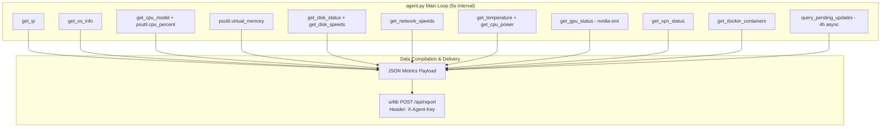

# 🤖 Agent Guide & Hardware Telemetry

The HomeLab Dashboard Agent (`agent/agent.py`) is a lightweight, portable Python script designed to run as a low-overhead background daemon on each monitored machine. It extracts deep hardware telemetry, power draw, container states, storage throughput, and pending updates across Linux, Windows, and macOS.

---

## 1. Overview & Architecture

- **Execution Interval**: Every 5 seconds (`INTERVAL = 5`).
- **Communication**: Outbound HTTP `POST` to `/api/report` with `X-Agent-Key`.
- **State Tracker**: Holds previous timestamps and counter readings (`bytes_sent`, `bytes_recv`, `read_bytes`, `write_bytes`, `energy_uj`) to compute live rates of change ($\Delta \text{value} / \Delta t$).
- **Non-blocking Operations**: Subprocess queries specify short timeouts (2–3s) and utilize the Windows `CREATE_NO_WINDOW` flag (`0x08000000`) so commands never steal focus from gaming or desktop workloads. Long-running checks (OS updates) run in an isolated daemon thread every 4 hours.



---

## 2. Sensor Instrumentation & Telemetry Details

### 2.1 CPU Marketing Name & OS Identification
Standard Python `platform.processor()` often returns generic identifiers like `x86_64`. The agent resolves exact marketing strings:
- **Windows**: Reads the registry key `HKEY_LOCAL_MACHINE\HARDWARE\DESCRIPTION\System\CentralProcessor\0\ProcessorNameString`.
- **Linux**: Scans `/proc/cpuinfo` for the `model name` line.
- **macOS**: Queries `sysctl -n machdep.cpu.brand_string`.
- **OS String**: Scans `/etc/os-release` (`PRETTY_NAME`) on Linux, and `platform.release()` + `platform.version()` on Windows.

---

### 2.2 Power Draw & Energy Telemetry (Wattage)

The agent implements a multi-tier hardware power detection strategy:

```mermaid
flowchart TD
    Start([Query CPU Power]) --> IsWin{OS == Windows?}
    
    IsWin -- Yes --> WinPerf[Query Energy Meter PerfCounter<br/><code>\Energy Meter(*_pkg)\Power</code>]
    WinPerf --> WinValid{Valid reading?}
    WinValid -- Yes --> ReturnW([Return Watts])
    WinValid -- No --> FallbackTDP
    
    IsWin -- No --> LinuxRAPL{RAPL file exists?<br/><code>/sys/class/powercap/.../energy_uj</code>}
    LinuxRAPL -- Yes --> CalcRAPL[Calculate dE / dt in Watts]
    CalcRAPL --> RAPLValid{0 <= W <= 500?}
    RAPLValid -- Yes --> ReturnW
    RAPLValid -- No --> LinuxHwmon
    LinuxRAPL -- No --> LinuxHwmon
    
    LinuxHwmon{Linux hwmon sensor exists?<br/>fam15h_power / zenpower / coretemp}
    LinuxHwmon -- Yes --> ReadHwmon[Read micro-watts / 1e6]
    ReadHwmon --> ReturnW
    LinuxHwmon -- No --> FallbackTDP
    
    FallbackTDP{CPU Model in TDP DB?<br/>GX-412TC / RX-421BD}
    FallbackTDP -- Yes --> MathModel[Compute idle_w + load * delta_w]
    MathModel --> ReturnW
    FallbackTDP -- No --> ReturnNull([Return None])
```

#### 1. Linux Running Energy RAPL (Running Average Power Limit)
Reads the cumulative micro-joules from `/sys/class/powercap/intel-rapl/intel-rapl:0/energy_uj` across Intel and modern AMD processors:
$$\text{Power (Watts)} = \frac{E_{\text{current}} - E_{\text{previous}}}{(\Delta t) \times 10^6}$$

#### 2. Linux Hardware Monitor (`hwmon`)
Inspects `/sys/class/hwmon/hwmon*/power*_input` with matching driver labels (`fam15h_power`, `zenpower`, `coretemp`, `intel_rapl`).

#### 3. Windows Performance Counters
Executes PowerShell counter query:
```powershell
(Get-Counter -Counter '\Energy Meter(*_pkg)\Power' -ErrorAction SilentlyContinue).CounterSamples.CookedValue
```
Converts milliwatts to Watts.

#### 4. Model-Based TDP Estimation Fallback
For embedded low-power appliances without hardware energy sensors (e.g., AMD embedded SoCs), the agent calculates power consumption using empirical load curves:
- **AMD GX-412TC (PC Engines APU2)**:
  $$P(\text{Watts}) = 3.5 + (6.0 - 3.5) \times \left(\frac{\text{CPU}_\%}{100}\right)$$
- **AMD RX-421BD (Merlin Falcon NAS SoC)**:
  $$P(\text{Watts}) = 6.0 + (15.0 - 6.0) \times \left(\frac{\text{CPU}_\%}{100}\right)$$
- **Generic AMD G-Series**:
  $$P(\text{Watts}) = 4.0 + (15.0 - 4.0) \times \left(\frac{\text{CPU}_\%}{100}\right)$$

---

### 2.3 CPU Temperature
- **Linux**: Queries `psutil.sensors_temperatures()` across `coretemp`, `cpu_thermal`, `acpitz`, with fallback to `/sys/class/thermal/thermal_zone0/temp`.
- **Windows**: Queries WMI namespaces `root/LibreHardwareMonitor` and `root/OpenHardwareMonitor` for sensors matching `SensorType = 'Temperature'` and name matching `*CPU Package*` or `*CPU Core*`.

---

### 2.4 NVIDIA GPU Monitoring
Executes `nvidia-smi` in CSV format without header:
```bash
nvidia-smi --query-gpu=name,utilization.gpu,utilization.memory,memory.total,memory.used,temperature.gpu,power.draw --format=csv,noheader,nounits
```
Extracts:
- Core GPU utilization (%)
- VRAM total vs. used (converted to Bytes)
- Core temperature (°C)
- Live power draw (Watts)

---

### 2.5 Storage Partitions & Disk I/O Throughput
- Scans `psutil.disk_partitions(all=False)`.
- Automatically excludes virtual and loop devices (`/proc`, `/sys`, `/dev`, `/run`, `/boot`, `/dev/loop*`).
- Records total capacity, used, free, and percentage per mount point.
- Measures live I/O speed ($\text{Bytes/sec}$) by calculating $\Delta \text{read\_bytes} / \Delta t$ and $\Delta \text{write\_bytes} / \Delta t$ using `psutil.disk_io_counters()`.

---

### 2.6 Network Throughput & VPN Interfaces
- **Bandwidth**: Computes live download and upload rates ($\text{Bytes/sec}$) via delta of `psutil.net_io_counters()`.
- **VPN State**: Checks `psutil.net_if_addrs()` for active interface prefixes:
  - **Tailscale**: `tailscale*`, `utun*`, `ts0`.
  - **OpenVPN**: `tun*`, `tap*`, `openvpn*`.

---

### 2.7 Docker Container Discovery
Executes `docker ps -a --format "{{.Names}}\t{{.State}}"` to list all container names and their live state (`Running`, `Exited`, `Paused`).

---

### 2.8 Pending OS Updates (Background Thread)
To ensure that package checks never block the 5-second real-time metrics push loop, the update check is performed asynchronously once every **4 hours** in a background daemon thread:
- **Ubuntu/Debian**: Reads the cached count from `/var/lib/update-notifier/updates-available` or queries `/usr/lib/update-notifier/apt-check`.
- **Windows**: Queries the Windows Update COM API:
```powershell
(New-Object -ComObject Microsoft.Update.Session).CreateUpdateSearcher().Search("IsInstalled=0 and Type='Software' and IsHidden=0").Updates.Count
```

---

## 3. Installation & Daemon Configuration

### 3.1 Linux / NAS Installation

#### Step 1: Install Python Environment
```bash
cd /opt
sudo git clone https://github.com/yourusername/homelab-dashboard.git
cd homelab-dashboard/agent
python3 -m venv .venv
source .venv/bin/activate
pip install -r requirements.txt
```

#### Step 2: Configure Credentials
Edit `agent.py` and set:
```python
SERVER_URL = "http://<YOUR-DASHBOARD-IP>:8000/api/report"
AGENT_KEY = "<YOUR_SERVER_AGENT_KEY>"
```

#### Step 3: Configure Systemd Daemon
Edit `homelab-agent.service`:
```ini
[Unit]
Description=HomeLab Dashboard Agent Service
After=network.target

[Service]
Type=simple
User=root
WorkingDirectory=/opt/homelab-dashboard/agent
ExecStart=/opt/homelab-dashboard/agent/.venv/bin/python agent.py
Restart=always
RestartSec=5

[Install]
WantedBy=multi-user.target
```

Enable and start the service:
```bash
sudo cp homelab-agent.service /etc/systemd/system/
sudo systemctl daemon-reload
sudo systemctl enable --now homelab-agent.service
```

---

### 3.2 Windows Silent Background Installation

To run the agent on Windows silently without popping up console windows or interrupting games:

1. **Install Virtual Environment**:
   ```powershell
   cd C:\Tools\homelab-dashboard\agent
   python -m venv .venv
   .\.venv\Scripts\pip.exe install -r requirements.txt
   ```
2. **Configure `agent.py`** with your `SERVER_URL` and `AGENT_KEY`.
3. **Configure Windows Task Scheduler**:
   - Open **Task Scheduler** $\rightarrow$ **Create Basic Task**.
   - **Name**: `HomeLab Agent`.
   - **Trigger**: `When I log on`.
   - **Action**: `Start a program`.
   - **Program/script**: Path to `pythonw.exe` (e.g., `C:\Tools\homelab-dashboard\agent\.venv\Scripts\pythonw.exe`). *Note: `pythonw` runs with no console window.*
   - **Add arguments**: `agent.py`.
   - **Start in**: `C:\Tools\homelab-dashboard\agent`.
   - In Task Properties, ensure **Run only when user is logged on** is selected, and under Settings, ensure **Do not start a new instance** if already running.
