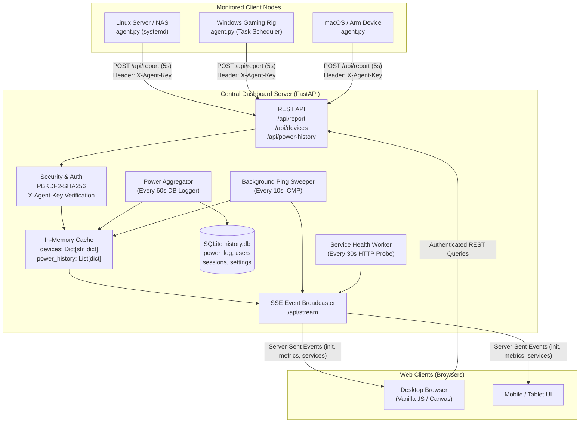
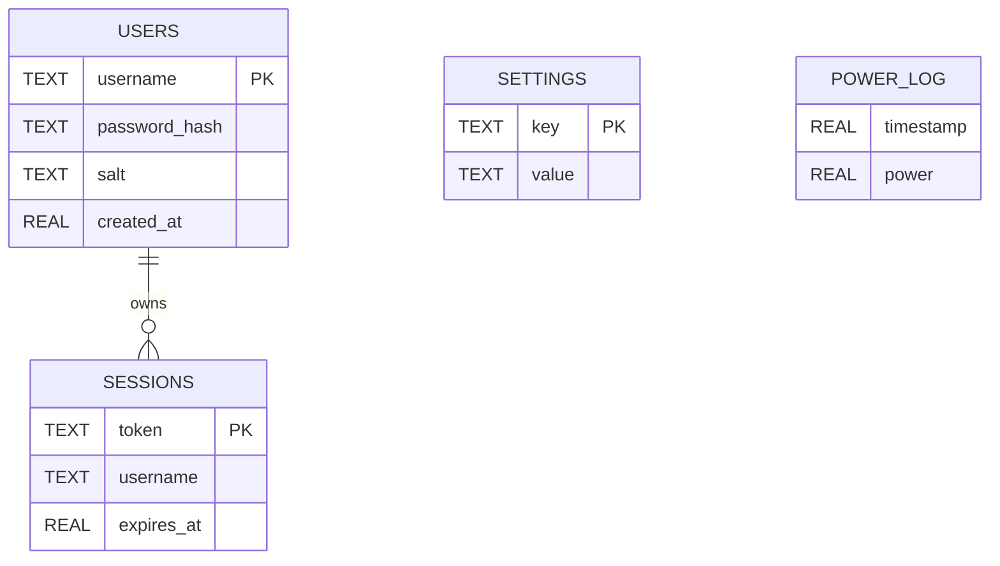
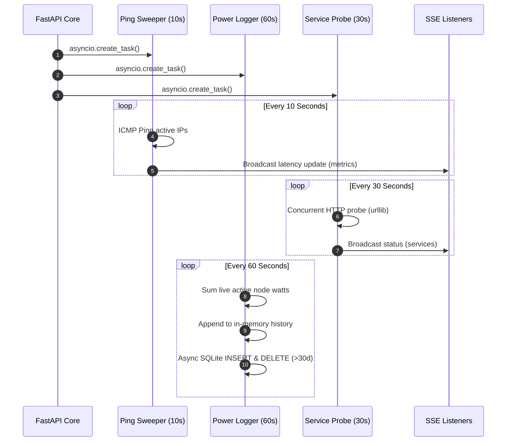

# 🏗️ System Architecture

This document provides an in-depth technical overview of the **HomeLab Dashboard** architecture, data flow pipelines, storage model, concurrency strategies, and design decisions.

---

## 1. High-Level Architecture Overview

The HomeLab Dashboard is designed specifically for resource-constrained, low-power homelab environments (such as PC Engines APU2, Intel NUCs, Raspberry Pis, and NAS servers) where traditional enterprise monitoring stacks (e.g., Prometheus + Grafana + Telegraf) are too heavy or cumbersome to configure across diverse operating systems and firewalls.

### Architectural Philosophy
1. **Push-based over Pull-based**: Client nodes push telemetry outbound via HTTP POST to the central dashboard server. This eliminates the need for the central server to know or access private IPs behind NATs, firewalls, or wireguard tunnels.
2. **Real-time Push to Browser (SSE)**: The frontend avoids periodic polling. The backend broadcasts updates over a persistent HTTP/1.1 **Server-Sent Events (SSE)** connection.
3. **Zero-Build Lightweight UI**: Built purely with HTML5, vanilla CSS custom properties (tokens), ES6 modules, and native Canvas API. No `npm build`, Webpack, Vite, or bloated UI frameworks.
4. **Resilient Local Persistence**: Telemetry is buffered in memory for ultra-fast instant lookups and persisted to SQLite on local SSDs with automatic mathematical downsampling for long-term history.



---

## 2. Telemetry Pipeline

### Step 1: Client Node Collection (`agent.py`)
- Every **5 seconds**, the client agent executes non-blocking system inspections:
  - CPU usage, memory, disk partitions, I/O rates, network bandwidth.
  - Hardware sensors: CPU temperature, CPU wattage (RAPL / hwmon / WMI / estimation).
  - Dedicated GPU metrics via `nvidia-smi` (load, VRAM, temp, wattage).
  - Docker containers and active VPN interfaces (Tailscale / OpenVPN).
  - Background asynchronous check for OS packages needing update (every 4 hours).
- Payload is compiled into a lightweight JSON object and submitted via an HTTP `POST` request to `/api/report` containing the `X-Agent-Key` header.

### Step 2: Ingestion & Enrichment (`main.py`)
1. **Authentication**: The server validates the incoming `X-Agent-Key` against the master key in the SQLite `settings` table.
2. **Enrichment**:
   - `last_seen` timestamp is updated to `time.time()`.
   - Current ping latency (if measured by the background sweeper) is preserved and attached.
   - Live `online` boolean state is calculated (`current_time - last_seen < 15s`).
3. **State Storage**: The record is stored in the in-memory `devices` dictionary (`devices[hostname] = data`).
4. **SSE Broadcast**: The enriched node state is immediately broadcast to all active SSE listener queues.

### Step 3: Real-Time Browser Rendering (`devices.js`)
1. Frontend receives the `metrics` event over SSE.
2. The node card is retrieved from the DOM cache or dynamically instantiated.
3. DOM nodes are updated directly via cached `data-r` attributes (avoiding DOM teardown and maintaining CSS transition animations).
4. CPU history ring buffer (length: 40) is updated and drawn to the HTML5 Canvas sparkline.
5. Dual-threshold hysteresis alerts are evaluated. If a threshold is crossed, a toast notification and Web Audio synthesized chime are triggered.

---

## 3. Database Schema & Downsampling Strategy

The backend uses a local SQLite database (`backend/history.db`) with custom indexes to support fast reads and historical downsampling.



### Table Definitions

#### `power_log`
Stores total lab power wattage at 1-minute intervals.
```sql
CREATE TABLE IF NOT EXISTS power_log (
    timestamp REAL,
    power REAL
);
CREATE INDEX IF NOT EXISTS idx_power_log_timestamp ON power_log(timestamp);
```
- **Pruning**: A background loop executes `DELETE FROM power_log WHERE timestamp < ?` every 60 seconds to purge entries older than **30 days** (2,592,000 seconds).

#### `users`
Stores administrative accounts.
```sql
CREATE TABLE IF NOT EXISTS users (
    username TEXT PRIMARY KEY,
    password_hash TEXT,
    salt TEXT,
    created_at REAL
);
```
- Passwords are encrypted with **PBKDF2-HMAC-SHA256** using 100,000 iterations and a cryptographically secure 16-byte random salt.

#### `sessions`
Tracks authenticated browser sessions.
```sql
CREATE TABLE IF NOT EXISTS sessions (
    token TEXT PRIMARY KEY,
    username TEXT,
    expires_at REAL
);
CREATE INDEX IF NOT EXISTS idx_sessions_expires ON sessions(expires_at);
```
- Default expiration is **14 days**.

#### `settings`
Stores configuration keys (e.g., `agent_auth_key`).
```sql
CREATE TABLE IF NOT EXISTS settings (
    key TEXT PRIMARY KEY,
    value TEXT
);
```

### Time-Series SQL Downsampling
To ensure instant loading times even with hundreds of thousands of historical power data points, `/api/power-history` utilizes integer-division time bucketing with SQL aggregate functions:

| Range | Query Window | Interval | SQL Bucket Expression | Approximate Points |
| :--- | :--- | :--- | :--- | :--- |
| **6H** | 6 hours | 60 seconds | In-memory RAM buffer (`power_history`) | 360 points |
| **24H** | 24 hours | 300 seconds (5 min) | `CAST(timestamp / 300 AS INTEGER) * 300` | 288 points |
| **7D** | 7 days | 1800 seconds (30 min) | `CAST(timestamp / 1800 AS INTEGER) * 1800` | 336 points |
| **30D** | 30 days | 7200 seconds (2 hr) | `CAST(timestamp / 7200 AS INTEGER) * 7200` | 360 points |

```sql
SELECT 
    CAST(timestamp / :interval AS INTEGER) * :interval AS grp, 
    AVG(power)
FROM power_log
WHERE timestamp >= :start_time
GROUP BY grp
ORDER BY grp ASC;
```

---

## 4. Concurrency & Background Worker Architecture

The FastAPI backend runs three non-blocking background loops initiated during the application startup hook (`@app.on_event("startup")`):



### 1. `ping_background_loop()`
- **Interval**: 10 seconds.
- **Action**: Iterates through all registered active hostnames in memory. For each active IP, invokes asynchronous sub-process ping command (`ping -c 1 -W 1 <ip>` on Linux or `ping -n 1 -w 1000 <ip>` on Windows).
- **Result**: Parses round-trip latency (ms) via regex and broadcasts updated latency to active clients.

### 2. `record_power_history_loop()`
- **Interval**: 60 seconds.
- **Action**: Aggregates CPU and GPU wattage across all active nodes (`is_active = (now - last_seen) < 15s`).
- **Result**: Appends to in-memory `power_history` buffer and executes non-blocking thread-pool SQLite write (`asyncio.to_thread`) to persist point to `power_log` and prune data older than 30 days.

### 3. `check_services_loop()`
- **Interval**: 30 seconds.
- **Action**: Reads `services.json` and probes all HTTP endpoints concurrently using `asyncio.gather(*tasks)`.
- **Result**: Measures response latency, records online/offline status, strips private internal URLs, and broadcasts sanitized payload to connected SSE clients.

---

## 5. Security & Isolation Model

### 1. Network Boundary Isolation
- **Agent to Dashboard**: Agents only make outbound connections to the central dashboard port (default: 8000). No inbound ports need to be opened on client machines.
- **Dashboard to Internet**: The dashboard server does not require external internet access to monitor devices.
- **Service Probing Security**: Target service URLs in `services.json` are probed from the dashboard server. They are never sent to or probed by the browser UI, preventing exposure of internal service ports or LAN topology.

### 2. Authentication & Authorization
- **Administrative Access**: All dashboard REST endpoints (`/api/devices`, `/api/power-history`, `/api/services`, `/api/stream`) require a valid Bearer token in the `Authorization` header.
- **First-Run Lockout**: The registration endpoint `/api/auth/register` is open strictly for the creation of the first admin user. Once `COUNT(*) > 0` in `users`, registration permanently returns `403 Forbidden`.
- **Agent Key**: All reports to `POST /api/report` require `X-Agent-Key` matching the cryptographically generated 32-character hexadecimal key stored in SQLite settings.

### 3. Frontend XSS Sanitization
- All client-supplied strings (such as hostnames, container names, CPU models, and OS names) are escaped via the `esc()` utility before insertion into DOM elements:
```javascript
export function esc(value) {
    if (value === undefined || value === null) return '';
    return String(value)
        .replace(/&/g, '&amp;')
        .replace(/</g, '&lt;')
        .replace(/>/g, '&gt;')
        .replace(/"/g, '&quot;')
        .replace(/'/g, '&#39;');
}
```
