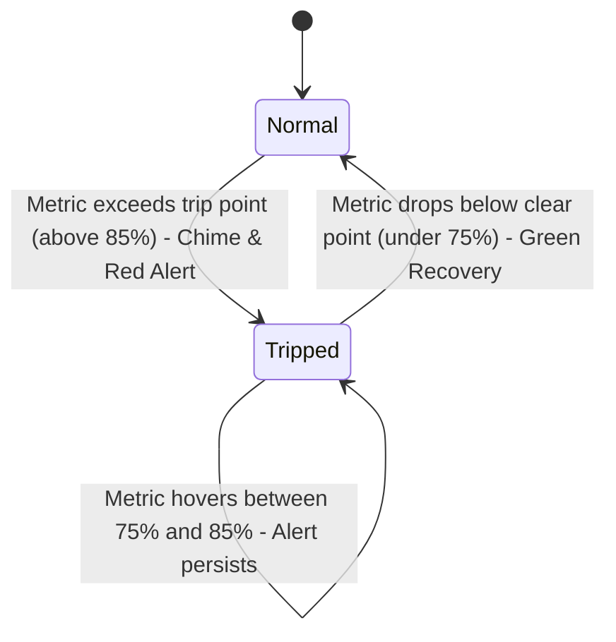

# 🎨 Frontend Architecture & Design System

The HomeLab Dashboard frontend is built entirely with **Vanilla JavaScript (ES6 Modules)**, **HTML5 Canvas**, and a **token-driven CSS architecture**. It requires zero build tooling, zero bundlers, and zero external runtime dependencies (except for FontAwesome icons and the Google Inter web font).

---

## 1. Directory & File Organization

```text
frontend/
├── index.html            # Main Devices & Hardware Monitoring Page
├── services.html         # Self-Hosted Web Services Health Page
├── css/
│   ├── tokens.css        # Core design tokens: colors, spacing, typography, motion
│   ├── base.css          # CSS reset, base elements, utility classes
│   ├── layout.css        # Page shell, topbar, fleet summary strips, responsive grid
│   └── components.css    # Node cards, meters, drawers, toasts, modals, buttons
└── js/
    ├── config.js         # Central constants: thresholds, hysteresis, tariff, timeouts
    ├── format.js         # String escaping, byte/speed/uptime formatting, icon mapper
    ├── api.js            # Fetch abstraction, token management, SSE stream URL builder
    ├── auth.js           # First-run admin setup overlay & sign-in / sign-out
    ├── shell.js          # Shared topbar header, agent key copy-to-clipboard, SSE link state
    ├── stream.js         # Resilient EventSource client with exponential backoff
    ├── charts.js         # High-DPI Canvas sparklines & interactive power trend chart
    ├── toast.js          # Notification toasts & synthesized Web Audio API alarm chime
    ├── devices.js        # Controller for index.html (grid, drawer, alert triggers)
    └── services-page.js  # Controller for services.html (categorized grid, summary stats)
```

---

## 2. Design System & CSS Tokens (`tokens.css`)

All visual styling is parameterized via CSS custom properties in the `:root` scope. Altering a token in `tokens.css` instantly themes the entire application across both pages.

### Token Palette Highlights

| Category | Token | Value / Purpose |
| :--- | :--- | :--- |
| **Surfaces** | `--bg` | `#0a0a0d` (Deep canvas dark background) |
| | `--surface-1` | `#121217` (Card and panel background) |
| | `--surface-2` | `#1a1a22` (Elevated tiles, drawers, input fields) |
| **Borders** | `--border` | `rgba(255, 255, 255, 0.08)` (Subtle separation lines) |
| | `--border-strong` | `rgba(255, 255, 255, 0.16)` (Hover states & focus rings) |
| **Metric Colors** | `--m-cpu` | `#38bdf8` (Vibrant cyan for CPU load) |
| | `--m-ram` | `#a855f7` (Purple for memory utilization) |
| | `--m-disk` | `#f97316` (Orange for storage capacity and I/O) |
| | `--m-net` | `#06b6d4` (Teal for network throughput) |
| | `--m-temp` | `#fb923c` (Warm amber for temperatures) |
| | `--m-power` | `#eab308` (Electric yellow for wattage) |
| **Status Tones** | `--ok` | `#22c55e` (Normal operation / online) |
| | `--warn` | `#f59e0b` (Approaching capacity or update pending) |
| | `--crit` | `#ef4444` (Critical load or threshold trip) |

---

## 3. Core Frontend Subsystems

### 3.1 DOM Element Caching & Animation Preservation (`devices.js`)
When telemetry arrives every 5 seconds, rebuilding the entire HTML card destroys CSS transition state and disrupts smooth meter animation.
- **Hook Caching**: Cards are created once via `buildCard()`. All interactive DOM hooks marked with `data-r="..."` (e.g. `ref.cpuBar`, `ref.ramValue`, `ref.latency`) are cached in a JavaScript object lookup:
```javascript
const ref = {};
el.querySelectorAll('[data-r]').forEach((node) => { ref[node.dataset.r] = node; });
```
- **Direct Mutators**: In `updateCard()`, properties are updated directly on the existing DOM elements, preserving continuous CSS width transitions.

---

### 3.2 Alert Hysteresis Engine
To prevent notification flapping when a metric rapidly oscillates around an alert boundary (e.g., jumping between 84% and 86%), the engine implements dual-threshold **hysteresis**:



- **Configured Thresholds (`config.js`)**:
  - `cpu`: Trip at $85\%$, Clear at $75\%$
  - `temp`: Trip at $80^\circ\text{C}$, Clear at $72^\circ\text{C}$
  - `gpuUtil`: Trip at $85\%$, Clear at $75\%$
  - `gpuTemp`: Trip at $80^\circ\text{C}$, Clear at $72^\circ\text{C}$

---

### 3.3 Web Audio API Synthesized Sci-Fi Chime (`toast.js`)
Rather than downloading external `.wav` or `.mp3` audio files, the dashboard synthesizes a sci-fi chime directly using the browser's native `AudioContext`:
- Dual-oscillator architecture:
  - **Carrier Oscillator** (`sine` wave): Sweeps from 880Hz down to 587.33Hz and 440Hz.
  - **Body Oscillator** (`triangle` wave): Drops from 440Hz to 220Hz for low-end punch.
  - **Gain Envelope**: Fast 50ms linear attack with exponential release to 0.001 over 650ms.
- **Audio Unlock Handler**: Modern browsers block unprompted audio until the user clicks on the page. `unlockAudioOnInteraction()` attaches a passive click listener to seamlessly resume the `AudioContext`.
- **Throttling**: Chimes are rate-limited to at most one chime every 20 seconds (`CHIME_THROTTLE_MS = 20000`).

---

### 3.4 High-DPI HTML5 Canvas Charting (`charts.js`)

#### 1. Real-Time Sparklines (`drawSparkline`)
- Renders an inline 40-point historical buffer on each device card.
- Computes `devicePixelRatio` scaling to guarantee crisp rendering on Retina/4K displays.
- Draws an area fill with a dynamic vertical alpha gradient followed by a smoothed stroke.

#### 2. Interactive Power Trend Chart (`createTrendChart`)
- Supports dynamic time ranges: `6H`, `24H`, `7D`, and `30D`.
- Computes horizontal watt gridlines with auto-scaling maximum peak headroom ($+12\%$).
- Implements interactive mouse tracking:
  - Draws a vertical hover crosshair.
  - Renders a positioned tooltip box displaying the exact wattage and formatted local timestamp.

---

### 3.5 Resilient SSE Connection Client (`stream.js`)
- Subscribes to `/api/stream?token=<token>`.
- Updates the topbar indicator dot (`Connecting`, `Live`, `Reconnecting`).
- Implements exponential backoff on error: starts at 2,000ms and caps at 30,000ms (`RECONNECT_MAX`) to prevent hammering the server during a restart or network outage.
