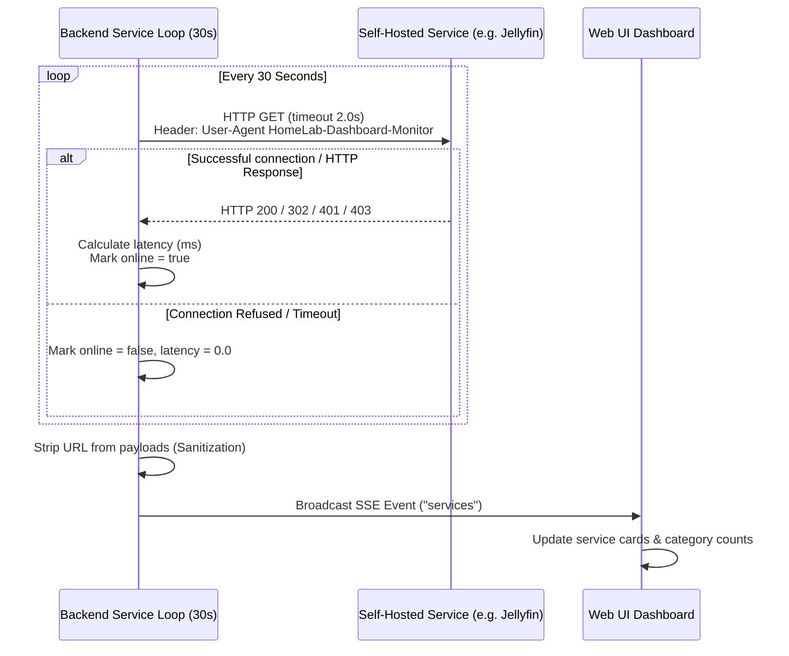

# 🌐 Services Monitoring

The HomeLab Dashboard includes a dedicated **Services Monitoring** subsystem that periodically tracks the health, reachability, and HTTP response latency of self-hosted web applications running in your homelab.

---

## 1. Overview & Operational Model

Unlike simple client-side status checkers, the HomeLab Dashboard probes services directly from the **dashboard server backend**:



### Key Advantages:
1. **Network Security & Isolation**: Internal IPs and port numbers configured in `backend/services.json` are **sanitized** by `get_sanitized_services()` and never broadcast to the browser.
2. **Bypasses CORS & Mixed-Content**: Browsers block cross-origin HTTP calls from HTTPS dashboards. Because the server conducts the probing via Python's native socket stack, CORS restrictions do not apply.
3. **Low Overhead**: Concurrently probes all targets every 30 seconds using `asyncio.gather(*tasks)` in a non-blocking thread pool.

---

## 2. Configuration (`services.json`)

The list of monitored services is defined in `backend/services.json`.

### Schema Definition

```json
[
  {
    "name": "Service Display Name",
    "url": "http://<IP-or-hostname>:<PORT>/path",
    "icon": "fa-<font-awesome-icon>",
    "category": "Category Group Name"
  }
]
```

### Property Reference

| Field | Type | Required | Description |
| :--- | :--- | :--- | :--- |
| `name` | `string` | **Yes** | Display name shown on the card (e.g., `Jellyfin`, `Immich`). |
| `url` | `string` | **Yes** | Full HTTP or HTTPS address checked by the backend. |
| `icon` | `string` | **Yes** | FontAwesome 6 icon class (e.g., `fa-play`, `fa-images`, `fa-cube`). |
| `category` | `string` | No | Grouping heading on the services page (default: `General`). |

---

## 3. Example `services.json`

```json
[
    {
        "name": "Jellyfin",
        "url": "http://192.168.1.104:8096",
        "icon": "fa-play",
        "category": "Media"
    },
    {
        "name": "Overseerr / Seerr",
        "url": "http://192.168.1.104:5055",
        "icon": "fa-magnifying-glass-plus",
        "category": "Media"
    },
    {
        "name": "Immich",
        "url": "http://192.168.1.104:2283",
        "icon": "fa-images",
        "category": "Photos"
    },
    {
        "name": "Uptime Kuma",
        "url": "http://192.168.1.105:3001",
        "icon": "fa-chart-line",
        "category": "Monitoring"
    },
    {
        "name": "Stirling PDF",
        "url": "http://192.168.1.105:8080",
        "icon": "fa-file-pdf",
        "category": "Tools"
    },
    {
        "name": "ChangeDetection",
        "url": "http://192.168.1.105:5000",
        "icon": "fa-eye",
        "category": "Tools"
    },
    {
        "name": "ntfy",
        "url": "http://192.168.1.105:7070",
        "icon": "fa-bell",
        "category": "Notifications"
    },
    {
        "name": "Sonarr",
        "url": "http://192.168.1.104:8989",
        "icon": "fa-tv",
        "category": "Arr Stack"
    },
    {
        "name": "Radarr",
        "url": "http://192.168.1.104:7878",
        "icon": "fa-film",
        "category": "Arr Stack"
    },
    {
        "name": "Prowlarr",
        "url": "http://192.168.1.104:9696",
        "icon": "fa-compass",
        "category": "Arr Stack"
    },
    {
        "name": "Bazarr",
        "url": "http://192.168.1.104:6767",
        "icon": "fa-closed-captioning",
        "category": "Arr Stack"
    },
    {
        "name": "Lidarr",
        "url": "http://192.168.1.104:8686",
        "icon": "fa-music",
        "category": "Arr Stack"
    }
]
```

---

## 4. Probing Behavior & Error Handling

1. **Timeout**: Probes timeout after **2.0 seconds** to avoid hanging the event loop.
2. **HTTP Error Codes**: If a service returns an HTTP status code such as `401 Unauthorized`, `403 Forbidden`, or `404 Not Found`, the backend recognizes that the web server is alive and responding, marking `online: true` and reporting valid round-trip latency.
3. **Connection Exceptions**: `URLError`, connection refused, socket timeout, or DNS failure marks `online: false` and sets `latency: 0.0`.
4. **Reloading Configuration**: When you modify `backend/services.json`, restart the backend server to apply changes (`sudo systemctl restart homelab-dashboard.service`).
